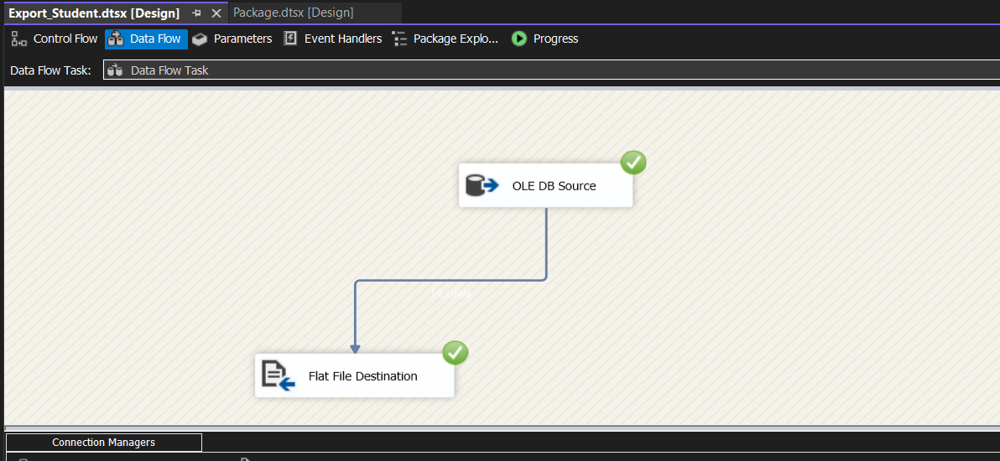
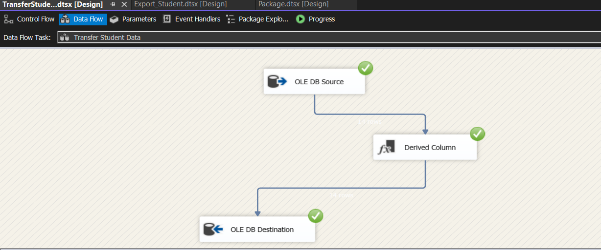
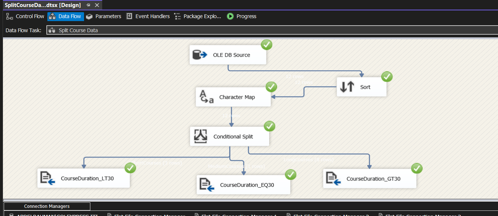
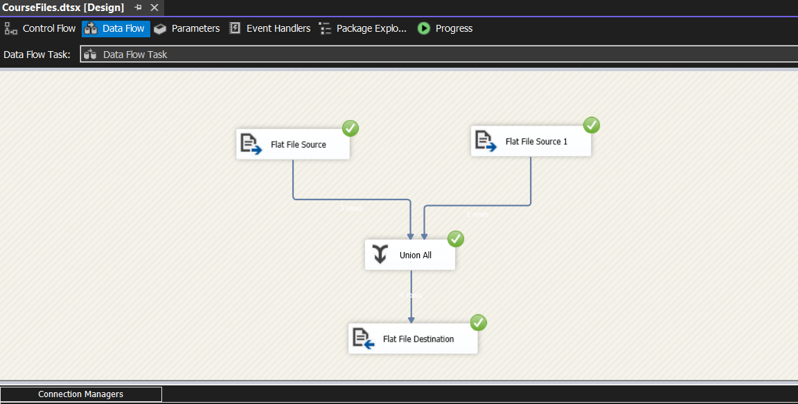
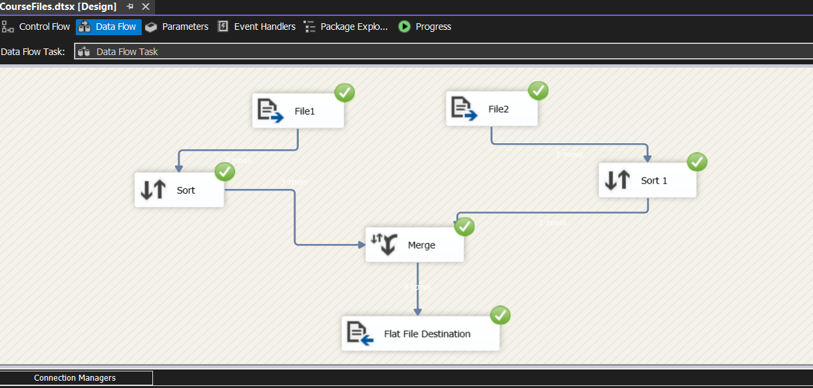

# SSIS

# SSIS Projects

**SQL Server Integration Services (SSIS)** packages that demonstrate different data integration scenarios such as exporting, transferring, splitting, and merging data.  

---

## 🧾 Export Student Data

**Description:**  
This package is designed to **export specific student data** from the ITI database into a new delimited flat file.  
The configuration ensures that **column names are included as the first row**, making the file easily readable and importable.

---

## 🔄 Transfer Student Data

**Description:**  
This comprehensive package transfers student data from one database to another while performing several key operations:

- **Preparation:**  
  Uses an *Execute SQL Task* to delete all existing data from the `Student` table in the Test DB.

- **Transformation:**  
  A *Derived Column* component merges the first and last names into a single field.

- **Backup & Error Handling:**  
  - Executes a *Back Up Database Task* for the Test DB.  
  - Includes an *Event Handler* that displays a message box (`"error occurred"`) if any component fails.

---

## ✂️ Split Course Data

**Description:**  
This task extracts **course data (including topic names)** from the ITI database and **splits it into three separate flat files** based on the course duration.

---

## 🔗 Merge Files

**Description:**  
This SSIS package merges `File1.txt` and `File2.txt` into one file using two methods:

1. **Merge Component (with Sorting)**  
   - Requires both input files to be sorted.  
   - Combines sorted outputs before writing to the final destination.  

2. **Union All Component (without Sorting)**  
   - Concatenates the inputs without sorting.  
   - Simpler method when sorting is not required for the desired output.

---

## 📂 Repository Structure

